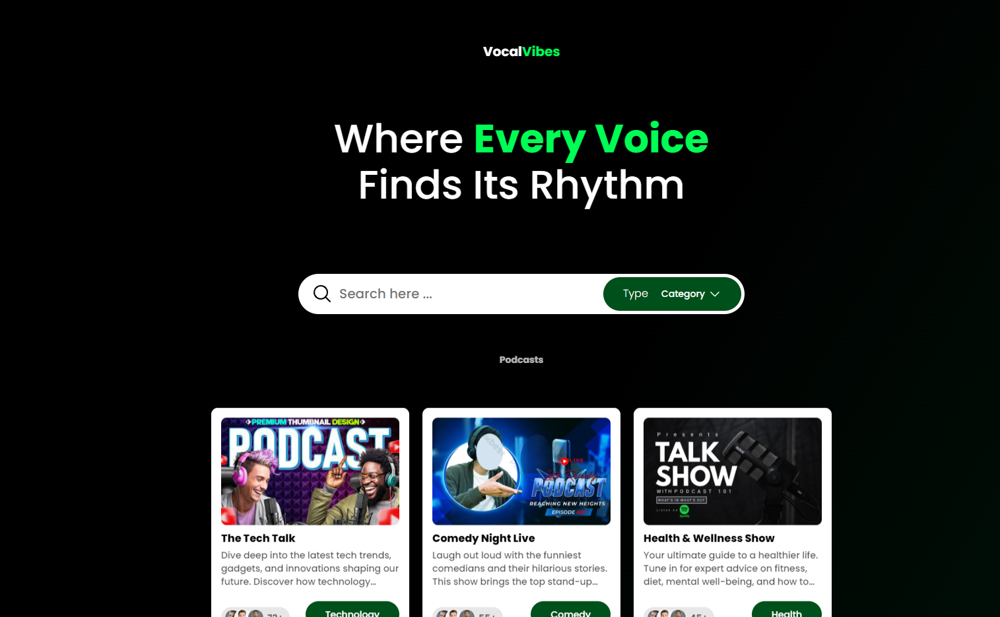
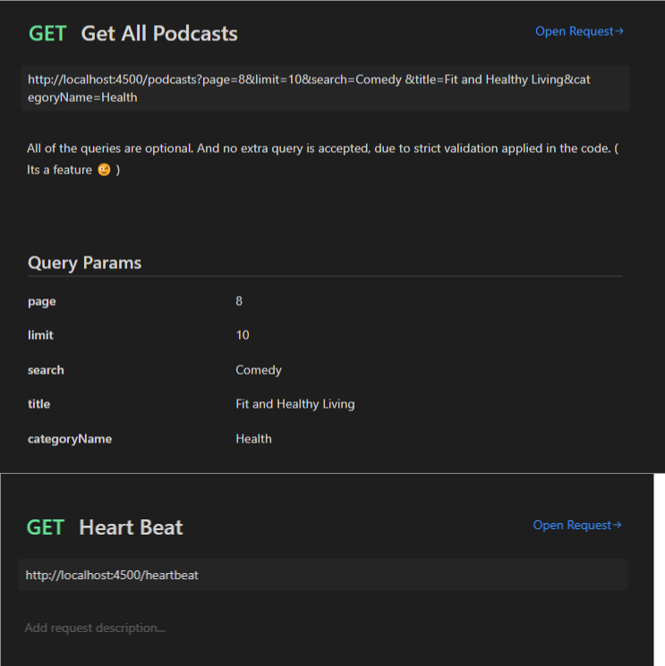

<a name="readme-top"></a>



<!-- TABLE OF CONTENTS -->

# 📗 Table of Contents

- [📖 About the Project](#about-project)
  - [🛠 Built With](#built-with)
    - [Tech Stack](#tech-stack)
    - [Key Features](#key-features)
  - [📷 Video Demo ](#live-demo)
  - [📃 API Documentation ](#api-documentation)
  - [🏃‍♂️ running-project ](#running-project)
- [👥 Authors](#authors)

<!-- PROJECT DESCRIPTION -->

# 📖 [Podcast Takehome Assessment] <a name="about-project"></a>

> A Podcast full stack website where users can search fo podcasts. Also giving the feature to filter podcast on Search term, with types "All" / "Title" / "category". And finally adding pagination.

## 🛠 Built With <a name="built-with"></a>

### Tech Stack <a name="tech-stack"></a>

> Next.js
> Express.js
> Figma

<details>
  <summary>Client</summary>
  <ul>
    <li>Next.js</li>
  </ul>
</details>

<details>
  <summary>Server</summary>
  <ul>
    <li>Express.js</li>
  </ul>
</details>

<details>
<summary>Database</summary>
  <ul>
    <li>JSON Array ( Mock Podcasts )</li>
  </ul>
</details>

<!-- Features -->

### Key Features <a name="key-features"></a>

Backend Features

- Backend Podcast Microservice with Express.js
- Filtering, Error Handling, rate-limiting and Heartbeat features in Backend
- The API supports "page" and "limit" params for pagination
- Yup Validation for Input Validation

Frontend Features

- Used Next.js for frontend
- Controlled input field to fetch podcasts. By default, all podcasts on initial load are requested.
- Rendering a list of podcast from the Request.
- Handling UI states for "When the podcasts are being fetched" , "When the response returns some podcasts" and "When the response returns no podcasts that match the search value"
- Debounce of 500ms is added to avoid fetching on every key press.
- (RWD) Responsive Web Design using media query
- Animation and Transition
- Eye Catching design

<p align="right">(<a href="#readme-top">back to top</a>)</p>

<!-- LIVE DEMO -->

## 📷 Video Demo <a name="live-demo"></a>

> <a href="https://youtu.be/hAf5bkVka80" >Video Live</a>

<p align="right">(<a href="#readme-top">back to top</a>)</p>

<!-- API Documentation -->

## 📃 API Documentation <a name="api-documentation"></a>



<p align="right">(<a href="#readme-top">back to top</a>)</p>

<!-- Running Project -->

## 🏃‍♂️ Run Project <a name="running-project"></a>

( Node.js must be installed )
### Run Frontend

install dependencies

```
npm install
```

Run Project

```
npm run dev // Will start on http://localhost:3000
```

### Run Backend

install dependencies

```
npm install
```

Run Project

```
npm start // Will start on http://localhost:4500
```

<p align="right">(<a href="#readme-top">back to top</a>)</p>

<!-- AUTHORS -->

## 👥 Author <a name="authors"></a>

👤 Shayan

- GitHub: [@githubhandle](https://github.com/shayan1234554321)
- LinkedIn: [LinkedIn](https://www.linkedin.com/in/shayan-khan20/)

<p align="right">(<a href="#readme-top">back to top</a>)</p>
